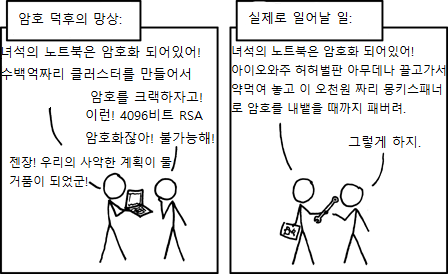
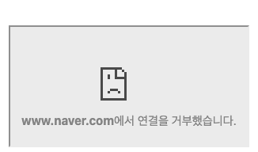
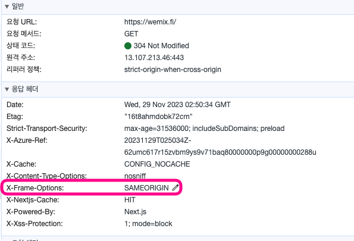
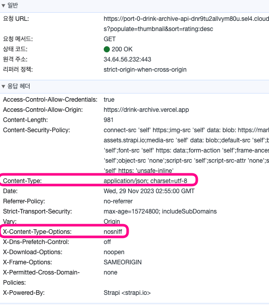

# HTTP 보안 헤더 살펴보기

<div style="width: 520px;">




</div>

웹사이트 성능만큼이나 중요한 것이 바로 보안이다. 웹사이트 보안을 높이기 위한 설정은 다양한 것이 있지만, 이번에는 특별히 HTTP 보안 헤더를 살펴보려고 한다.

HTTP 보안 헤더는 브러우저가 렌더링하는 내용과 관련된 보안 취약점을 미연에 방지하기 위해 브라우저와 함께 작동하는 것을 말한다.

대표적인 것들을 함께 알아보자.

<br />

## HTTP Strict-Transport-Security (HSTS)

모든 사이트가 HTTPS를 통해 접근해야 하며, HTTP로 접근하면 모든 시도를 HTTPS로 변경한다.

2010년 이후의 출시된 대부분의 Web에서 HSTS 기능을 지원하고 있다.

HSTS를 통해 http://wemix.fi 로 연결하는 것을 https://wemix.fi 로 연결하게 된다. (단순 예시 웹)

실제로 **SSL Striping**이라는, HTTPS 통신을 HTTP로 변경하려 비밀번호 등을 탈취하려는 해킹 시도가 많다.

우리가 https로 접속해도, 중간에 응답을 가로채어 http로 변경 후 사이트를 전송하고, 그 사이에서 정보를 빼앗아 가는 것이다.

이런 공격을 막아주는 것이 바로 HSTS이다.

여기서 HTTPS가 HTTP보다 보안이 더 좋은 이유는, SSL/TLS에 대해 알아보면 좋다. 쉽게 얘기하면, 데이터를 암호화하여 전송하는 것이다.

```
// 사용 예시
Strict-Transport-Security: max-age=<expire-time>
// 기본 값
Strict-Transport-Security: max-age=<expire-time>; includeSubDomains
Strict-Transport-Security: max-age=<expire-time>; includeSubDomains; preload
```

### 설정값

`expire-time` : 해당 설정을 브라우저가 기억해야 하는 시간, 저 기간 내에는 모든 요청은 HTTPS로 하게 된다.

해당 설정이 0이 라면 HTTP로 요청하게 된다. 일반적으로 1년 단위, 권장값은 2년이다. 헤더가 브라우저에 전달될 때마다 사이트의 만료 시간을 업데이트하기 때문에 사이트는 정보를 새로 고칠 수 있고, 만료되는 것을 방지할 수 있다.

`includeSubDomains` : 모든 하위 도메인에도 적용

`preload` : Chrome의 HSTS에 목록에 도메인을 제출하는 것. HSTS를 미리 로드하려는 경우 양식을 보내 요청할 수 있다. 기본적으로는 포함되지 않는데 요청, 제거할 때 양식을 보내야 하고, 적용하는 데 몇 개월이 걸려 추천하지 않는다.

https://hstspreload.org/?domain=wemix.fi 에서 확인할 수 있다.

<br />

## X-XSS-Protection

현재 사파리와 구형 브라우저에서만 제공되는 기능이다.

XSS 취약점이 발견되면 페이지 로딩을 중단한다. Content-Security-Policy가 있다면 필요가 없는 기능이다.

Content-Security-Policy가 지원하지 않는 브라우저에서는 사용할 수 있다.

최신 브라우저에서는 이런 보호 기능이 거의 필요하지 않다.

<br />

## X-Frame-Options

frame, iframe, embed 등 내부에서 페이지 렌더링을 허용할지 설정하는것이다.

아래 코드를 보면, iframe을 통해 [naver.com](http://naver.com) 을 불러오고 있다.

```html
<div>
  <iframe src="https://naver.com"></iframe>
</div>
```

결과는 아래와 같다.



naver에는 X-Frame-options을 통해, 외부에서 iframe 삽입을 막았기 때문에 확인할 수 없다.

wemix.fi도 막혀있다. 설정을 보면 X-Frame-Options가 SAMEORIGIN인 것을 확인할 수 있다.



허용된 사이트는 아래처럼 잘 나온다.


iframe을 통한 공격으로는, **클릭재킹(Clickjacking)** 이라는 것이 있다.

naber.com이라는 사이트 내부에 naver.com을 iframe으로 불러와 마치 naver인 것처럼 보여지며, 중간에 다른 요소를 넣어 사용자에게 악성 코드 설치나, 다른 사이트로 유도할 수 있다.

이런 공격은 **X-Frame-Options**를 통해 막을 수 있다.

옵션은 2가지 이다.

`X-Frame-Options: DENY` : 모든 곳에서 페이지 로드를 막는다.

`X-Frame-Options: SAMEORIGIN` : 같은 origin에서만 표시할 수 있다.

<br />

## Permissions-Policy

웹사이트에서 사용할 수 있는 기능과 사용할 수 없는 기능을 명시적으로 선언하는 것.

브라우저의 기능이나 API를 활성화, 비활성화 할 수 있다. (GPS, 카메라, 마이크, 스피커 등)

사용자의 위치를 확인하는 geolocation을 XSS공격 등으로 인해, 사용자의 위치를 확인할 수도 있는데, Permissions-Policy를 이용하면 이런 것들을 사전에 차단할 수 있다.

설정해두지 않으면 모두 허용이다.

```js
// geolocation 차단
Permissions-Policy: geolocation=()

// 카메라 허용
Permissions-Policy: camera=*

// iframe에서 Permissions-Policy를 사용
<iframe src="https://example.com" allow="geolocation 'none'"></iframe>
```

아래 코드를 이용하면, 사용자의 위치를 알아낼 수 있다.(XSS 예)

```js
// 위치 정보를 읽는 함수
function getLocation() {
  if (navigator.geolocation) {
    navigator.geolocation.getCurrentPosition(
      function (position) {
        alert(position.coords.latitude + ' ' + position.coords.longitude);
      },
      function (error) {
        console.error(error);
      },
      {
        enableHighAccuracy: false,
        maximumAge: 0,
        timeout: Infinity,
      }
    );
  }
}
getLocation();
```

<br />

## X-Content-Type-Options

Content-type 헤더에서 제공하는 유형이 브라우저에 의해 변경되지 않게 하는 헤더이다.

우리가 데이터 전송을 할 때 Content-type에 text/html, css, json, application/javascript 등을 설정할 수 있다.

여기서 X-Content-Type-Options를 설정해 주면, 브라우저가 임의로 파일을 해석하지 않는다.

일반적으로 html 전송 시에는 text/html 설정으로 보낸다.

아래는 일반적인 API 요청이다. application/json으로 되어 있기에, object 형태로 데이터를 해석해 준다.



만약, 누군가가 .jpg라는 확장자로 파일을 전송했는데, 실제로는 jpg가 아니라 스크립트의 내용일 수 있다. 여기서 X-Content-Type-options가 잘못된 설정으로 인해, jpg안의 내용을 확인 후 스크립트 내용을 실행할 수도 있게 된다.

아래처럼 설정해 둔다면, 임의로 변경되지 않는다.

```
X-Content-Type-Options: nosniff
```

<br />

## Referrer-Policy

Referrer-policy 설정은 현재 요청을 보낸 페이지의 주소가 나타난다. 만약 어떠한 링크를 통해 페이지를 들어왔다면, 사용자가 어디서 왔는지 인식할 수 있다. 이는 반대로, 사용자 입장에서는 원치 않는 정보가 노출될 수도 있다는 것이다.

아래처럼 meta 태그를 통해 설정할 수 있다.

```jsx
<meta name="referrer" content="origin" />
```

혹은 a 태그에서도 설정할 수 있다. 이는 검색 엔진에 영향을 미친다.

```jsx
<a href="http://example.com" rel="noreferrer">
  …
</a>
```

```
// referer 생략
Referrer-Policy: no-referrer
// oriogin에만 referer를 보냄
Referrer-Policy: origin
// https -> https인 경우에만 보냄
Referrer-Policy: strict-origin
// 기본 설정, 동일한 origin, 동일한 프로토콜 보안일 때 출처, 경로, 쿼리를 보냄
Referrer-Policy: strict-origin-when-cross-origin
// 항상 다 보냄
Referrer-Policy: unsafe-url
```

<br />

## Content-Security-Policy

content-security-policy는 XSS공격이나 데이터 삽입 등 다양한 보안 위협을 막기 위해 설계된 설정이다.

### -src

font-src, img-src, script-src 등에서 src를 제어할 수 있다.

아래처럼 선언한다면 선언된 font 소스만 가져올 수 있고, 그 외에는 모두 차단된다.

```
Content-Security-Policy: font-src <source>;
```

그 외 설정

```
// 모든 콘텐츠가 사이트 자체 원본에서만 허용.
Content-Security-Policy: default-src 'self'

// 신뢰할 수 있는 도메인과 모든 하위 도메인의 콘텐츠를 허용
Content-Security-Policy: default-src 'self' example.com *.example.com
```

<br />

## Next.js 보안 헤더 설정하기

Next.js에서 HTTP 경로별로 보안 헤더를 설정할 수 있다. next.config.js에서 이 기능을 제공한다.

```js
module.exports = {
  async headers() {
    return [
      {
// 모든 주소에 설정
        source: '/:path*',
        headers: [
	        {
              key: 'X-Frame-Options',
              value: 'DENY',
          },
          {
            key: 'X-Content-Type-Options',
            value: 'nosniff',
          },
					{
            key: 'Permissions-Policy',
            value: 'camera=(), battery=(self), geolocation=(), microphone=('https://a-domain.com')',
          },
        ],
      },
    ]
  },
}
```

<br />

## 보안 헤더 확인하는 사이트

아래 사이트에 들어가면, 검색을 통해 http security report를 볼 수 있다.

https://securityheaders.com/

비교를 위해, 똑같은 코드로 사이트를 2개를 배포 후, 한 사이트에는 보안 설정을 아무것도 하지 않은 기본 상태로 두었고, 다른 하나는 위에 나온 설정들을 모두 주었다.

**적용전**


**적용후**


간단한 코드 설정만으로도 웹 보안을 신경 쓸 수 있다!

<br />

## 그 외에 찾아보면 좋은 것

### OWASP TOP 10

OWASP는 OPen Worldwide Application Security Project의 약자로, 웹에서 발생할 수 있는 악성 스크립트, 보안 취약점 등을 연구하며 주기적으로 10대 웹 애플리케이션 취약점을 공개한다.

매번 보안 취약점에 따라 순위를 매긴다.

아래 사이트에서 그 내용들을 확인할 수 있다.

https://owasp.org/www-project-top-ten/

### mdn

https://developer.chrome.com/articles/permissions-policy/  
https://developer.mozilla.org/en-US/docs/Web/HTTP/Headers/Strict-Transport-Security  
https://developer.mozilla.org/en-US/docs/Web/HTTP/Headers/X-XSS-Protection  
https://developer.mozilla.org/en-US/docs/Web/HTTP/Headers/X-Frame-Options  
https://developer.mozilla.org/en-US/docs/Web/HTTP/CSP  
https://developer.mozilla.org/en-US/docs/Web/HTTP/Headers/Referrer-Policy

### web dev

https://web.dev/articles/csp  
https://web.dev/articles/referrer-best-practices
